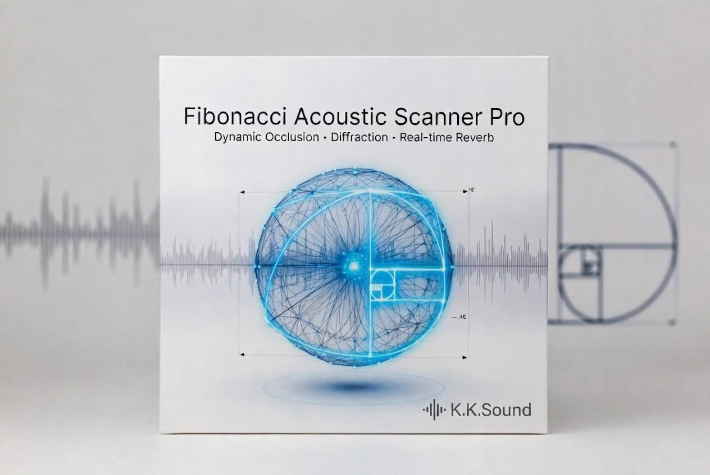

# Fibonacci Acoustic Scanner Pro
### Dynamic Occlusion · Diffraction · Real-time Reverb
**Version 1.0** · by K.K.Sound

---



---

## Overview

Fibonacci Acoustic Scanner Pro is a runtime acoustic simulation plugin for Unity + Wwise. It uses a Fibonacci sphere of raycasts to model how sound behaves in real environments — attenuating through walls, diffracting around corners, and reverberating according to the size and surface materials of the space the listener occupies.

**Core features:**
- Per-emitter occlusion with multi-ray sampling and wall thickness estimation
- Edge-based diffraction around obstacles
- Real-time room scanning via Fibonacci sphere — drives reverb decay time and send level
- Per-material absorption coefficients with Scene-view debug ray colours
- Distance-based LPF via Wwise Attenuation
- LOD system — update rate scales with distance to listener
- One-click scene setup via Editor window
- Live RTPC monitor window

---

## Requirements

- Unity 2021.3 or later
- Wwise 2022.1 or later with the Unity Integration package installed
- The `AK_WWISE_UNITY_API` scripting define must be present (added automatically by the Wwise Unity Integration)
- Python 3.7+ (for the Wwise auto-setup script)

---

## Installation

### Unity
1. Import `FibonacciAcousticScannerPro_v1.0.unitypackage` into your project.
2. Open **Window → Acoustics → Scene Setup** and follow the four steps.

### Wwise
1. Make sure Python 3.7+ is installed on your machine.
2. In Wwise, enable the Authoring API: **Project → User Preferences → Enable Wwise Authoring API**.
3. Open a terminal, navigate to the `Wwise/` folder and run:
   ```
   python setup_wwise.py
   ```
4. The script creates all required Game Parameters, the Aux Bus, and default RTPC curves automatically.
5. Assign the generated Game Parameters to the `AcousticRTPCConfig` asset in Unity.
6. Generate SoundBanks: **Generate All** in the SoundBank Manager.

Optional script arguments:
```
python setup_wwise.py --sound "MySound"
python setup_wwise.py --sound-path "\\Actor-Mixer Hierarchy\\Default Work Unit\\MyFolder" --sound "MySound"
python setup_wwise.py --no-sound
```

---

## Quick Start

| Step | What to do |
|------|-----------|
| 1 | Open **Window → Acoustics → Scene Setup** |
| 2 | Click **Create AcousticManager** |
| 3 | Click **Setup Main Camera as Listener** (or assign manually to the player's head) |
| 4 | Select a sound-emitting object, click **Add Emitter to Selection** |
| 5 | Click **Create Material Config Asset** and assign it in both `RoomScanner` and `AcousticEmitter` |
| 6 | Assign your `AcousticRTPCConfig` asset to `AcousticManager` |
| 7 | Run the Wwise setup script and regenerate SoundBanks |
| 8 | Press Play |

---

## Wwise Setup (manual)

If you prefer to configure Wwise by hand instead of using the script:

**Game Parameters required:**
| Name | Range | Notes |
|------|-------|-------|
| `Acoustics_Occlusion` | 0 – 100 | Controls Voice Volume and LPF |
| `Acoustics_Diffraction` | 0 – 100 | Controls Voice Volume and LPF |
| `Acoustics_RoomSize` | 0 – 100 | Controls Reverb Decay Time |
| `Acoustics_ReverbAmount` | 0 – 100 | Controls Aux Bus send volume |

**Aux Bus:**
- Create an Aux Bus named `Aux_Reverb` under Master Audio Bus
- Add a **Wwise RoomVerb** effect
- RTPC on RoomVerb: `Decay Time → Acoustics_RoomSize` (0.2 s to 5.0 s)
- RTPC on Aux Bus: `Output Bus Volume → Acoustics_ReverbAmount` with the following curve:

| X (ReverbAmount) | Y (Volume) |
|-----------------|------------|
| 0 | -200 dB |
| 35 | -200 dB |
| 100 | 0 dB |

> The flat section at 0–35 ensures reverb is silent outdoors where ReverbAmount is low.

**Sound objects:**
- Enable **Game-Defined Auxiliary Sends** on each sound
- Set **Early Reflections → Aux_Reverb**, Volume = 100
- Add RTPC curves: Voice Volume and LPF → Acoustics_Occlusion and Acoustics_Diffraction

---

## Component Reference

### AcousticEmitter
Attach to any GameObject that emits sound. Performs multi-ray occlusion sampling toward the listener and feeds data to `WwiseAcousticBridge` every frame.

| Property | Description |
|----------|-------------|
| Config | AcousticMaterialConfig asset |
| Extra Ray Count | Additional rays around the primary ray cone (default: 16) |
| Spread Angle | Cone half-angle in degrees (default: 15) |
| Max Distance | Beyond this distance the emitter reports zero occlusion (default: 60) |
| Thickness Method | `None` / `Bounds` / `DoubleRay` |
| Max Wall Thickness | Maximum wall thickness in metres (default: 5) |
| Thickness Influence | How much wall thickness modulates absorption (default: 0.4) |
| Smoothing Speed | Lerp speed toward target occlusion (default: 3) |

---

### AcousticListener
Attach to the same GameObject as Unity's AudioListener (player head or Main Camera).

| Property | Description |
|----------|-------------|
| Max Rays Per Emitter | Maximum rays cast per emitter per scan (default: 64) |
| Geometry Mask | Layers that block sound — **exclude Player and Pickable layers** |

---

### RoomScanner
Attach to the same GameObject as `AcousticListener`. Scans the surrounding space and outputs `CurrentRoomSize` and `CurrentReverb`.

| Property | Description |
|----------|-------------|
| Material Config | AcousticMaterialConfig asset |
| Ray Count | Fibonacci sphere density (default: 44) |
| Max Ray Distance | Upper bound for room size normalisation (default: 90) |
| Max Room Size | Distance at which RoomSize reaches 1.0 (default: 90) |
| Smoothing Speed | Lerp speed for RoomSize and ReverbAmount (default: 3) |
| Update Interval | Scan every N frames — 0 = every frame (default: 6) |

---

### DiffractionCalculator
Attach to the same GameObject as `AcousticEmitter`. Calculates edge-based diffraction.

| Property | Description |
|----------|-------------|
| Edge Step | Step size when scanning obstacle edges (default: 0.1) |
| Max Edge Search | Maximum search radius in metres (default: 8) |
| Visibility Rays | Rays for line-of-sight confirmation (default: 3) |
| Smoothing Speed | Interpolation speed — increase to 8–12 to fix sharp outdoor jumps |

---

### AcousticMaterialConfig
ScriptableObject. Maps Unity object tags to absorption coefficients and debug ray colours.

| Property | Description |
|----------|-------------|
| Tag | Unity object tag to match |
| Absorption | 0 = fully reflective, 1 = fully absorptive |
| Debug Color | Ray colour shown in Scene view |
| Default Absorption | Fallback when no tag matches (default: 0.5) |
| Sky Absorption | Applied when rays miss all geometry — set 0.9 to suppress outdoor reverb |
| Sky Debug Color | Ray colour for sky rays |

---

### AcousticRTPCConfig
ScriptableObject. Links Unity-side logic to Wwise Game Parameters.

Assign each RTPC field by clicking the `>>` button and selecting the corresponding Game Parameter from your Wwise project. Set **RTPC Scale** to 100 so normalised 0–1 values map to 0–100 in Wwise.

---

### PickupItem
Attach to any prop the player can carry (radio, speaker, boombox). Works together with `PlayerPickup` on the player object.

| Property | Description |
|----------|-------------|
| Prompt Text | Text shown on screen when player is in pickup range |
| Hold Offset | Position offset relative to the hold point when carried |
| Hold Rotation | Euler rotation applied while held |
| Pickup Sound | Wwise Event posted when picked up |
| Putdown Sound | Wwise Event posted when put down |

> AcousticEmitter remains active while the item is carried — reverb updates in real time as the player moves between rooms.

---

## Debug Tools

**RTPC Monitor** — open via **Acoustics → RTPC Debug Monitor**  
Shows live bar graphs for all four RTPC values and occlusion detail for the nearest emitter.

**RoomScanner Inspector** — green/red toggle button to enable or disable ray visualisation. Live RoomSize and ReverbAmount progress bars visible in Play Mode.

**Scene View rays** — colour-coded by surface material as defined in `AcousticMaterialConfig`.  
Green = sky ray · Red = geometry hit · Magenta = wall thickness probe

---

## Performance Notes

- Default ray counts: RoomScanner = 44 rays, AcousticEmitter = 17 rays total (1 primary + 16 extra). Well within budget for most platforms.
- The LOD system reduces emitter update frequency with distance. Tune `AcousticManager → LOD Settings` for your target platform.
- Disable `Show Debug Rays` and `Show Gizmo Rays` in builds.
- On mobile, reduce `Max Emitters Per Frame` to 5–8 and `RoomScanner Update Interval` to 8–12.

---

## Troubleshooting

| Problem | Solution |
|---------|----------|
| No occlusion or reverb | Check AcousticRTPCConfig is assigned. Verify all 4 Game Parameters are set. Regenerate SoundBanks. |
| Occlusion = 100% near emitter | Remove Player layer from AcousticListener Geometry Mask. |
| Reverb not audible | Check Aux_Reverb Output Bus. Enable "Use game-defined aux sends". Set Early Reflections Volume = 100. |
| Reverb too loud outdoors | Set Sky Absorption = 0.9. Verify ReverbAmount RTPC curve has flat -200 dB section for values 0–35. |
| Reverb stuck when carrying emitter | Ensure you are using the latest `AcousticEmitter.cs` (v1.0 fix). |
| Sharp diffraction jump along wall | Increase DiffractionCalculator Smoothing Speed to 8–12. |
| Emitter falls through floor | Add Sphere Collider (Is Trigger = false) for physics and Box Collider (Is Trigger = true) for pickup. |

---

## License

© 2026 K.K.Sound. All rights reserved.  
This plugin is provided for use in personal and commercial projects.  
Redistribution or resale of the source code is not permitted.

---

## Links

- **itch.io** — [download and support](https://kksound.itch.io/fibonacci-acoustic-scanner-pro)
- **GitHub** — [source code](https://github.com/kkSound/FibonacciAcousticScannerPro)

---

## Contact

For support, feedback, or feature requests — leave a comment on the [itch.io page](https://kksound.itch.io/fibonacci-acoustic-scanner-pro).
